
<h1>Apps using the Android Beacon Library</h1>

Over 4000 mobile applications worldwide use the Android Beacon Library, running on the phones of many millions of users.  Below is just a sample of these
apps.

<h2>Retail</h2>

<a href='https://play.google.com/store/apps/details?id=com.munrodev.crfmobile'>
  
Carrefour 
</a>

<a href='https://play.google.com/store/apps/details?id=com.cvs.launchers.cvs'>
  
CVS 
</a>

<a href='https://play.google.com/store/apps/details?id=com.dylvian.mango.activities'>
  
Mango 
</a>

<!--

<a href='https://play.google.com/store/apps/details?id=com.rtmart'>
  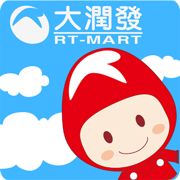
RTMart 
</a>

-->

<a href='https://play.google.com/store/apps/details?id=com.emart.today'>
  
Emart 
</a>

<a href='https://play.google.com/store/apps/details?id=ro.ropardo.coresi.experiente'>
  
Coresi 
</a>

<h2>Restaurants</h2>

<a href='https://play.google.com/store/apps/details?id=be.mcdonalds.mcdo'>
  
McDonalds 
</a>

<a href='https://play.google.com/store/apps/details?id=com.bbq.android'>
  
Genesis BBQ 
</a>

<a href='https://play.google.com/store/apps/details?id=ws.hanzo.cupcakeito.loyalty'>
  
Cupcake.ito
</a>

<a href='https://play.google.com/store/apps/details?id=com.myorder.app.kfc'>
  
KFC 
</a>

<h2>Transportation</h2>

<a href='https://play.google.com/store/apps/details?id=com.airfrance.android.dinamoprd'>
  
Air France
</a>

<a href='https://play.google.com/store/apps/details?id=com.verisun.mobiett'>
  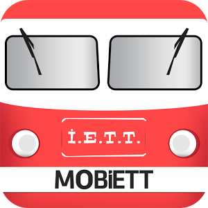
Mobiett Instanbul Subway 
</a>

<a href='https://play.google.com/store/apps/details?id=de.berlinairport.app'>
  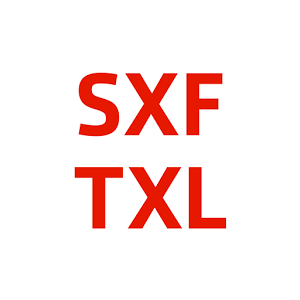
Berlin Airport 
</a>

<a href='https://play.google.com/store/apps/details?id=com.hailocab.consumer'>
  
Hailo 
</a>

<a href='https://play.google.com/store/apps/details?id=com.hotspot.hotspotmobile'>
  
Hotspot 
</a>

<h2>Sports</h2>

<a href='https://play.google.com/store/apps/details?id=com.yinzcam.nba.wizards'>
  
Washington Wizards 
</a>

<a href='https://play.google.com/store/apps/details?id=com.yinzcam.nhl.capitals'>
  
Washington Capitals 
</a>

<a href='https://play.google.com/store/apps/details?id=intermaps.iskitracker'>
  
iSki Tracker 
</a>

<a href='https://play.google.com/store/apps/details?id=uk.co.tribehive.fli.boro'>
  
Boro Connect
</a>

<h2>Finance</h2>

<a href='https://play.google.com/store/apps/details?id=com.Tobit.android.Slitte5914405785'>
  
Volksbank
</a>

<a href='https://play.google.com/store/apps/details?id=com.beamwallet'>
  
BeamWallet 
</a>

<a href='https://play.google.com/store/apps/details?id=wit.android.bcpBankingApp.activoBank'>
  
Activo Bank
</a>

<a href='https://play.google.com/store/apps/details?id=wit.android.bcpBankingApp.millennium'>
  
Millennium BCP
</a>

<a href='https://play.google.com/store/apps/details?id=com.kbcard.cxh.appcard'>
  
KMotion AppCard 
</a>

<h2>News</h2>

<a href='https://play.google.com/store/apps/details?id=com.indusblue.montrealgazette'>
  
Montreal Gazette 
</a>

<a href='https://play.google.com/store/apps/details?id=com.indusblue.vancouversun'>
  
Vancouver Sun 
</a>

<a href='https://play.google.com/store/apps/details?id=com.indusblue.edmontonjournal'>
  
Edmonton Journal 
</a>

<h2>Tourism</h2>

<a href='https://play.google.com/store/apps/details?id=com.cedarfair.kingsisland'>
  
  Kings Island Park
</a>

<a href='https://play.google.com/store/apps/details?id=com.merlin.madame.tussauds.london'>
  
  Madame Tussauds
</a>

<a href='https://play.google.com/store/apps/details?id=com.proxiot.horti'>
  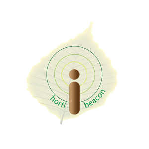
HortiBeacon
</a>

<h2>Hotels</h2>

<a href='https://play.google.com/store/apps/details?id=com.accor.appli.hybrid'>
  
AccorHotels Hotel booking
</a>

<a href='https://play.google.com/store/apps/details?id=com.runtriz.radissonblu'>
  
Raddisson Blu 
</a>

<h2>Conventions and Festivals</h2>

<a href='https://play.google.com/store/apps/details?id=com.konvurj'>
  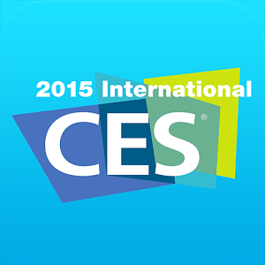
CES 2015 
</a>

<a href='https://play.google.com/store/apps/details?id=me.doubledutch.whiskyfestchicago'>
  
WhiskeyFest 
</a>

<a href='https://play.google.com/store/apps/details?id=me.doubledutch.academyofgeneraldentistry'>
  
Academy of General Dentistry 
</a>

<a href='https://play.google.com/store/apps/details?id=ru.geekpicnic'>
  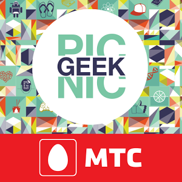
Geek Picnic
</a>

<h2>Games</h2>

<a href='https://play.google.com/store/apps/details?id=com.bestcoolfungames.antsmasher'>
  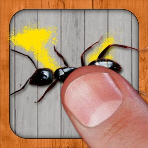
AntSmasher
</a>

<a href='https://play.google.com/store/apps/details?id=com.creativemobile.roadsmash'>
  
Road Smash 
</a>

<h2>Home and Lifestyle</h2>

<a href='https://play.google.com/store/apps/details?id=com.technogym.tgapp'>
  
Technogym
</a>

<a href='https://play.google.com/store/apps/details?id=com.smartthings.android'>
  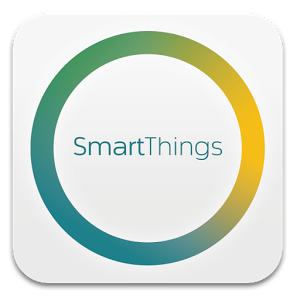
SmartThings 
</a>

<a href='https://play.google.com/store/apps/details?id=com.qihoo360.mobilesafe'>
  
360 Mobile Safe 
</a>

<a href='https://play.google.com/store/apps/details?id=com.mediarare.docappointment'>
  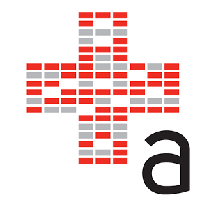
DocAppointment 
</a>

<h2>Shopping</h2>

<a href='https://play.google.com/store/apps/details?id=com.coupgon.coupgon'>
  
Coupgon
</a>

<a href='https://play.google.com/store/apps/details?id=com.auchan.android'>
  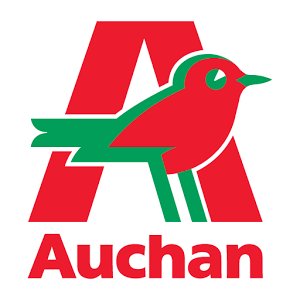
MyAuchan
</a>

<a href='https://play.google.com/store/apps/details?id=com.rover.rovertown'>
  
Rovertown
</a>

<a href='https://play.google.com/store/apps/details?id=networld.price.app'>
  
Networld Price App 
</a>

<a href='https://play.google.com/store/apps/details?id=com.sourcenetworkapp.groupbuyer.activities'>
  
Group Buyer 
</a>

<h2>Music</h2>

<a href='https://play.google.com/store/apps/details?id=nl.qmusic.app'>
  
QMusic 
</a>

<a href='https://play.google.com/store/apps/details?id=com.roqbot.client'>
  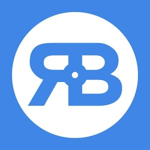
Rockbot
</a>

